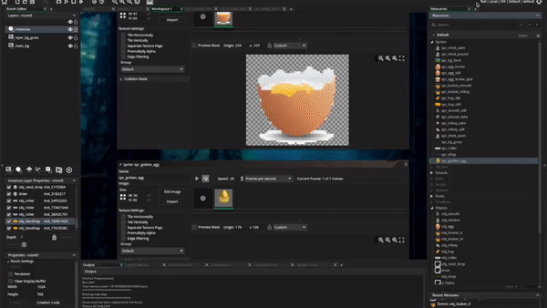

# Welcome to university.college.dublin

### Table of Content
*All folders contain : lecture slides, notes and exercises*

<i>algorithm advanced structures :</i>
<a href="./ucd.algorithm.advanced.structures">comp47500</a>

> topics : trees, linklist, heap, hash.tables, dictionaries, array lists and stacks and queues, big o, vectors
+ [part a](./ucd.algorithm.advanced.structures/alg.ad.parta) exercises(racing graphics with java)
+ [part b](./ucd.algorithm.advanced.structures/alg.ad.partb) exercises(phone game with trees)

<i>cloud computing :</i>
<a href="./ucd.cloud.computing">comp30520</a>

> topics : service research, preparing for cloud services, google app engine, map reduce basic, pig latin, map reduce advanced
+ [lectures](./ucd.cloud.computing/comp.cloud.lec) (lecture slides pdf)
+ [notes](./ucd.cloud.computing/comp.cloud.notes) (lecture notes)
+ [lab 1](./ucd.cloud.computing/comp.cloud.lab/comp.cloud.prac1) (service research)
+ [lab 2](./ucd.cloud.computing/comp.cloud.lab/comp.cloud.prac2) (preparing for cloud services)
+ [lab 3](./ucd.cloud.computing/comp.cloud.lab/comp.cloud.prac3) (google app engine)
+ [lab 4](./ucd.cloud.computing/comp.cloud.lab/comp.cloud.prac4) (map reduce basic)
+ [lab 5](./ucd.cloud.computing/comp.cloud.lab/comp.cloud.prac5) (pig latin)
+ [lab 6](./ucd.cloud.computing/comp.cloud.lab/comp.cloud.prac6) (map reduce advanced)
+ [project](./ucd.cloud.computing/comp.cloud.todolist) (project with angular and firebase)

<i>distributed systems :</i>
<a href="./ucd.distributed.systems">comp30220</a>

> topics : service quotation broker, details on final assignment, group paper, jms, socket, rmi, soap, rest, actors, project with angular and firebase
+ [lectures](./ucd.distributed.systems/dis.sys.lec) (lecture slides pdf)
+ [notes](./ucd.distributed.systems/dis.sys.notes) (lecture notes)
+ [lab 1](./ucd.distributed.systems/dis.sys.lab/dis.sys.actor.programming) (service quotation broker)
+ [lab 2](./ucd.distributed.systems/dis.sys.lab/dis.sys.group.final.assignment) (details on final assignment)
+ [lab 3](./ucd.distributed.systems/dis.sys.lab/dis.sys.group.paper) (group paper)
+ [lab 4](./ucd.distributed.systems/dis.sys.lab/dis.sys.message.oriented.system) (jms)
+ [lab 5](./ucd.distributed.systems/dis.sys.lab/dis.sys.prac1.socket) (socket)
+ [lab 6](./ucd.distributed.systems/dis.sys.lab/dis.sys.prac2.rmi) (rmi)
+ [lab 7](./ucd.distributed.systems/dis.sys.lab/dis.sys.prac3.soap) (soap)
+ [lab 8](./ucd.distributed.systems/dis.sys.lab/dis.sys.prac4.rest) (rest)
+ [lab 9](./ucd.distributed.systems/dis.sys.lab/dis.sys.prac5.actors) (actors)
+ [project](./ucd.distributed.systems/dis.sys.squidit) (project with angular and firebase)

 

<i>ruby rails :</i>
<a href="./ucd.ruby.rails">comp41100</a>

> topics : lecture slides pdf, lecture notes, ruby & command line setup, basic do's and dont's, inheritance and seperate files, book library simulator, itunes simulator with cvs 1, itunes simulator with cvs 2, fraud email check with scraping, film actors net search with scraping, book library simulator advanced with lambda, create your own app, chicken game rails, blog rails
+ [lectures](./ucd.ruby.rails/ruby.lec) (lecture slides pdf)
+ [notes](./ucd.ruby.rails/ruby.notes) (lecture notes)
+ [lab 1](./ucd.ruby.rails/ruby.lab/ruby.prac1) (ruby & command line setup)
+ [lab 2](./ucd.ruby.rails/ruby.lab/ruby.prac2) (basic do's and dont's)
+ [lab 3](./ucd.ruby.rails/ruby.lab/ruby.prac3) (inheritance and seperate files)
+ [lab 4](./ucd.ruby.rails/ruby.lab/ruby.prac4) (book library simulator)
+ [lab 5](./ucd.ruby.rails/ruby.lab/ruby.prac5) (itunes simulator with cvs 1)
+ [lab 6](./ucd.ruby.rails/ruby.lab/ruby.prac6) (itunes simulator with cvs 2)
+ [lab 7](./ucd.ruby.rails/ruby.lab/ruby.prac7) (fraud email check with scraping)
+ [lab 8](./ucd.ruby.rails/ruby.lab/ruby.prac8) (film actors net search with scraping)
+ [lab 9](./ucd.ruby.rails/ruby.lab/ruby.prac9) (book library simulator advanced with lambda)
+ [lab 10](./ucd.ruby.rails/ruby.lab/ruby.prac10) (create your own app)
+ [lab 11](./ucd.ruby.rails/ruby.lab/ruby.prac11) (chicken game rails)
+ [lab 12](./ucd.ruby.rails/ruby.lab/ruby.prac12) (blog rails)

 

<i>user experience :</i>
<a href="./ucd.user.experience">comp47680</a>

> topics : the three waves and methods
+ [lectures](./ucd.user.experience/ux.lec) (lecture slides pdf)
+ [notes](./ucd.user.experience/ux.notes) (lecture notes)
+ [essay](./ucd.user.experience/ux.lab/ux.essay) (ux the three waves)

 

<i>contemp development :</i>
<a href="./ucd.contemp.development">comp47480</a>

> topics : 
+ [lectures](./ucd.contemp.development/contemp.dev.pdf) (lecture slides pdf)
+ [notes](./ucd.contemp.development/contemp.dev.notes.txt) (lecture notes)
+ [lab 1](./ucd.contemp.development/contemp.dev.assignments/contemp.lab1) (agile term research)
+ [lab 2](./ucd.contemp.development/contemp.dev.assignments/contemp.lab2) (uml exercise)
+ [lab 3](./ucd.contemp.development/contemp.dev.assignments/contemp.lab3) (ger hartnett : talk mongodb)
+ [lab 4](./ucd.contemp.development/contemp.dev.assignments/contemp.lab4) (junit)
+ [lab 5](./ucd.contemp.development/contemp.dev.assignments/contemp.lab5) (peter : talk 8bytes)

 

<i>game development :</i>
<a href="./ucd.game.development">comp30540</a>

> topics : 
+ [lectures](./ucd.game.development/game.dev.pdf) (lecture slides pdf)
+ [notes](./ucd.game.development/game.dev.notes.txt) (lecture notes)
+ [project 1](./ucd.game.development/game.dev.game/game.assignment1) (chicken game with gml)
<section data-markdown>

</section>

+ [project 2](./ucd.game.development/game.dev.game/game.assignment2) (drone game with unity)

 

<i>ios cocotouch :</i>
<a href="./ucd.ios.cocotouch">comp47390</a>

> topics : 
+ [lectures](./ucd.ios.cocotouch/ios.pdf) (lecture slides pdf)
+ [notes](./ucd.ios.cocotouch/ucd.ios.notes.txt) (lecture notes)
+ [teachers projects](./ucd.ios.cocotouch/ios.teacher.projects) (teachers projects)
+ [project 1](./ucd.ios.cocotouch/ios.student.projects/ios.projects.assignment.submissions/ios.projects.connect.4) (ai bot connect 4 game) 
+ [project 2](./ucd.ios.cocotouch/ios.student.projects/ios.projects.assignment.submissions/ios.projects.tweetertags) (twitter tags bot)

 

<i>java professional advanced :</i>
<a href="./ucd.java.advanced">comp41200</a>

> topics : 
+ [lectures](./ucd.java.advanced) (advanced java course pdfs)

 

<i>python data analystics :</i>
<a href="./ucd.python.data.analystics">comp41680</a>

> topics : 
+ [lectures](./ucd.python.data.analystics/python.pdf) (lecture slides pdf)
+ [notes](./ucd.python.data.analystics/python.notes.txt) (lecture notes)
+ [labs](./ucd.python.data.analystics/python.labs) (labs for python with a variety of exercises)
+ [project](./ucd.python.data.analystics/python.assignments/python.assignment.pythongraph.1) (pythongraph : using api and json to collect weather data)

 

<i>spanish 101 :</i>
<a href="./ucd.spanish.101">cspanish</a>

> topics : 
+ [lectures](./ucd.spanish.101) (spanish 101 course pdfs)

 

 

<i>audited courses :</i>
<a href="./ucd.course.audit">csaudits</a>

> topics : big data, french, intro security, recommended systems, text analystics
[big data](./ucd.course.audit/ucd.big.data)
[french](./ucd.course.audit/ucd.french)
[intro security](./ucd.course.audit/ucd.intro.security)
[recommended systems](./ucd.course.audit/ucd.rec.sys)
[text analystics](./ucd.course.audit/ucd.text.analystics)

 

---

### Course Description
Students have the opportunity to negotiate a programme of learning that is tailored to their own career goals and requirements. Instead of there being a rigorous set of modules that each student must take, as is typical in standard taught MSc programmes, students can prefer to broaden their knowledge acrossa diverse cross-section of modules offering by Schools such as the UCD School of Computer Science, UCD School of Business, UCD School of Maths & Statistics and the UCD School of Information & Communication Studies. Students enrolling in this MSc are also provided with the opportunity to work on a specialised research task and/or work as part of a research group as part of this programme.

### Vision and Values Statement
- Purpose
This programme aims to provide students with a wide range of specialist learning opportunities that can be selected in a bespoke manner to suit the individual skills and aspirations of the individual.  It can thus serve both as a form of extended continued professional development, as a means to upskill or to reorient a technical career.  The programme is also suited as a foundation for advanced research within IT. An extensive variety of learning pathways is offered, with many modules grouped into thematic streams, providing coherent clusters in specific technical areas.  

- Education and subject description, professional values
It aspires to offer state of the art instruction in a very wide variety of technical subjects, leveraging the broad range of expertise available in the faculty of UCD.  For the student, it provides an opportunity to personally design a course of study that matches their specific goals.  Modules range over many technical specialities that are in high demand with employers. 

- Learning outcomes
Students will select modules from a very broad list, and will therefore encounter many different kinds of instruction.  Many students will take part in group projects of a practical nature. The variety of modules on offer ensures that students can develop both technical skills and enhance their critical thinking. 

- Approaches to teaching learning and assessment
Because of the variety of courses on offer, many different forms of evaluation may be used, including exercises, written assignments, programming challenges, literature reviews and end of module examinations.  The programme aspires to encourage the intellectual skills required to synthesise and integrate insights from many perspectives. 

### Programme Outcomes
- Work effectively within a small team of specialists to achieve specific practical goals in solving problems within the IT domain and in cooperation with other stakeholders
- Effectively marshall a variety of expert skills towards focussed goals within the student's chosen IT domain
- Develop an awareness of the current state of the art within their specific domain of expertise, including future prospects and opportunities
- Communicate technical work effectively to both a specialised and a general audience in word and in text, through writing and in public presentations
- Achieve competence across a broad range of foundational subject matter within the IT domain, while developing advanced expertise in one or two selected areas
- Develop the ability to assess and critique state of the art developments within their chosen filed.
- Recognise and manage the theoretical diversity found within the many specialties within information technology.
- Achieve competence across a broad range of foundational subject matter within the IT domain, while developing advanced expertise in one or two selected areas
- Communicate technical work effectively to both a specialised and a general audience in word and in text, through writing and in public presentations
- Develop an awareness of the current state of the art within their specific domain of expertise, including future prospects and opportunities
- Develop the ability to assess and critique state of the art developments within their chosen filed.
- Effectively marshall a variety of expert skills towards focussed goals within the student's chosen IT domain
- Recognise and manage the theoretical diversity found within the many specialties within information technology.
- Work effectively within a small team of specialists to achieve specific practical goals in solving problems within the IT domain and in cooperation with other stakeholders

### Entry Requirements
This programme is intended for applicants with a Computer Science or ICT background. An upper second class honours degree, or the international equivalent in computer science or a related area or a minimum of three years’ relevant industrial work experience is required.
Applicants whose first language is not English must also demonstrate English language proficiency of IELTS 6.5 (no band less than 6.0 in each element), or equivalent.

### Testimonial
> Graduate Profile : Rohan Singla, India,
> Assistant Manager : Advisory at Grant Thornton

The reputation of the UCD School of Computer Science and Informatics made me feel secure about my decision to move to Ireland from Mumbai. I was drawn to the wide range of modules available. Through the ‘negotiated learning’ format, I got an option to choose my modules ranging from information security to cloud computing. The masters degree gave me both a theoretical and practical background allowing me to develop and convey technical and strategic advice to my wide range of Fortune 500 clients at work, be it Deloitte in the past or Grant Thornton now. Apart from studies, UCD is a great campus with many activities going on across its parks and student facilities every day.

~ download pdf here: [ucd brochure](./university.college.dublin.pdf)
